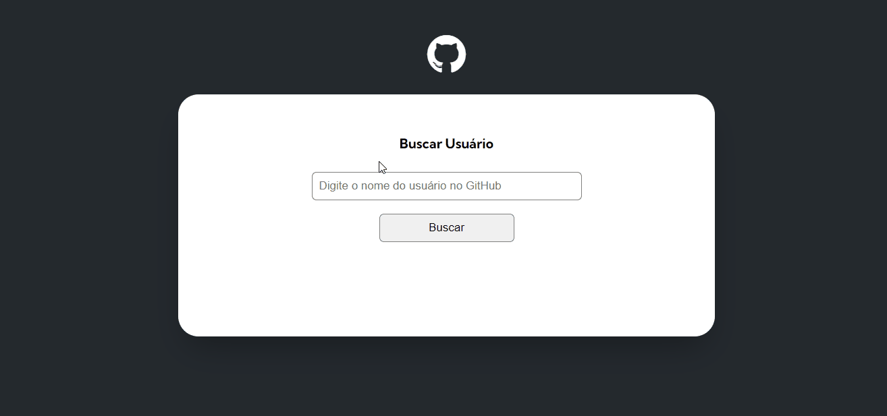

# Meu primeiro Projeto com a api do GitHub

Projeto pessoal feito para testar meus conhecimentos em **API** com **JavaScript**.


### Preview do projeto😁


### [Entre no site](https://niivl.github.io/Projeto-com-api-do-GitHub/)

## ⛏️Tecnologias ultilizadas
- HTML
- CSS
- JavaScript

## 🕵️Como ultilizar
- Insira o nome de um usuário do Github e clique em buscar para que o site te mostre algumas informações sobre o usuário.

## 🖇️Clone o projeto
Observação: Tenha o Git instalado no seu computador. Caso não tenha, você pode baixar [aqui](https://git-scm.com/downloads).

#### 1 - URL do projeto
URL: https://github.com/NiivL/Projeto-com-api-do-GitHub.git

2 - Abra o terminal e navegue até o diretório desejado:
```bash
cd /caminho/para/o/diretorio
```
3 - Clone o repositório:
```bash
git clone https://github.com/NiivL/Projeto-com-api-do-GitHub.git
```

### Pronto, agora você pode contribuir com o projeto😊